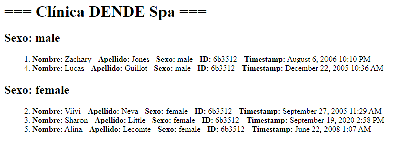

# Desafío Evaluado - Citas médicas

## Descripción

La clínica DENDE Spa ha tenido problemas con su software de gestión de citas y necesita una aplicación que pueda registrar nuevos usuarios y almacenar su nombre, apellido, sexo, hora en que fueron registrados, e indispensablemente, un código identificador. 

En este desafío, deberás crear un servidor en Node.js que permita registrar usuarios y disponibilice una ruta para consultar todos los usuarios registrados. La implementación debe usar diversas dependencias de NPM para el manejo de datos y la generación de identificadores únicos.

## Vista del Diseño

Aquí puedes ver la imagen del diseño que se utilizó como referencia:

## Requerimientos

1. **Registro de Usuarios**:
   - Usa la API Random User para consultar la información del usuario y el paquete `axios` para realizar la solicitud.

2. **Generación de Identificadores**:
   - Cada usuario debe tener un campo `id` único generado por el paquete `UUID`.

3. **Registro de Fecha**:
   - Cada usuario debe tener un campo `timestamp` que almacene la fecha de registro, formateada usando el paquete `Moment`.

4. **Consulta de Usuarios**:
   - En cada consulta realizada al servidor, devuelve una lista con los datos de todos los usuarios registrados. Usa el paquete `Lodash` para dividir el arreglo en dos, separando a los usuarios por sexo.

5. **Impresión en Consola**:
   - En cada consulta también se debe imprimir por la consola del servidor la misma lista de usuarios pero con fondo blanco y color de texto azul usando el paquete `Chalk`. 
6. **Reinicio Automático**:
   - El servidor debe ser levantado con el comando `Nodemon`. 

## Tecnologías Utilizadas

- **Node.js**: Entorno de ejecución para JavaScript en el servidor.
- **Express**: Framework para Node.js que facilita la creación y manejo del servidor y las rutas.
- **Axios**: Paquete para realizar solicitudes HTTP.
- **UUID**: Paquete para generar identificadores únicos.
- **Moment**: Paquete para el manejo y formato de fechas.
- **Lodash**: Paquete para el manejo de datos y operaciones con arrays.
- **Chalk**: Paquete para estilizar mensajes en la consola.
- **Nodemon**: Herramienta para reiniciar automáticamente el servidor cuando se realizan cambios en el código.

## Autor

Este proyecto fue desarrollado por **Valeria Torrealba**.
